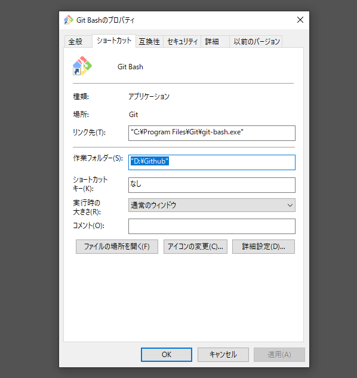

# ✅Windows で Arm Cortex-A Baremetal 開発環境構築

### TOC

## 0. ダウンロードリンク

必要なもの

* [Make for Windows](http://gnuwin32.sourceforge.net/packages/make.htm)
* [GNU Toolchain for the A-profile Architecture](https://developer.arm.com/tools-and-software/open-source-software/developer-tools/gnu-toolchain/gnu-a/downloads)
* [Git for Windows](https://gitforwindows.org/)


## 1. Make のインストール

インストーラー `make-3.81.exe` をダウンロードしてインストール。パスを通す。

```:Path (e.g.
C:\Program Files (x86)\GnuWin32\bin
```

コマンドプロンプトで動作確認。

```:Command prompt
make --version
GNU Make 3.81
Copyright (C) 2006  Free Software Foundation, Inc.
これはフリーソフトウェアです. 利用許諾についてはソースを
ご覧ください.
商業性や特定の目的への適合性の如何に関わらず, 無保証です.

This program built for i386-pc-mingw32
```


## 2. GCC のインストール

ツールチェーンをダウンロードしてインストール。パスを通す。

```:Path (e.g.
D:\***\ARM_Baremetal\gcc-arm-9.2-arm-none-eabi\bin
D:\***\ARM_Baremetal\gcc-arm-9.2-aarch64-none-elf\bin
```

コマンドプロンプトで動作確認。

```:Command prompt
arm-none-eabi-gcc --version
arm-none-eabi-gcc (GNU Toolchain for the A-profile Architecture 9.2-2020.02 (arm-9.10)) 9.2.1 20191025
Copyright (C) 2019 Free Software Foundation, Inc.
This is free software; see the source for copying conditions.  There is NO
warranty; not even for MERCHANTABILITY or FITNESS FOR A PARTICULAR PURPOSE.
```

```:Command prompt
aarch64-none-elf-gcc --version
aarch64-none-elf-gcc (GNU Toolchain for the A-profile Architecture 9.2-2020.02 (arm-9.10)) 9.2.1 20191025
Copyright (C) 2019 Free Software Foundation, Inc.
This is free software; see the source for copying conditions.  There is NO
warranty; not even for MERCHANTABILITY or FITNESS FOR A PARTICULAR PURPOSE.
```


## 3. 動作確認

適当なCファイルと Makefile を作ってコマンドプロンプトでコンパイルする。

```:Command prompt
make
arm-none-eabi-gcc -mcpu=cortex-a35 -I include -Wall -O2 -nostartfiles -ffreestanding  -c source/main.c -o main.o
arm-none-eabi-as -mcpu=cortex-a35 -c source/start.s -o start.o
arm-none-eabi-ld -nostdlib -T link.lds main.o start.o -o main.elf
arm-none-eabi-objcopy -O binary main.elf main.bin
```

おめでとう。


## 4. より扱いやすくするために

Git for Windows のGit Bash がとても便利。コマンドプロンプトでは実行できなかった、Makefile内のBashコマンドが実行できるようになる。

ショートカット（タスクバーなどの）のプロパティで、実行時の初期ディレクトリを設定することもできる。



## (5. 感想)

こんな超楽ちんだったのか。Linux マシンがいらなくなってしまった。